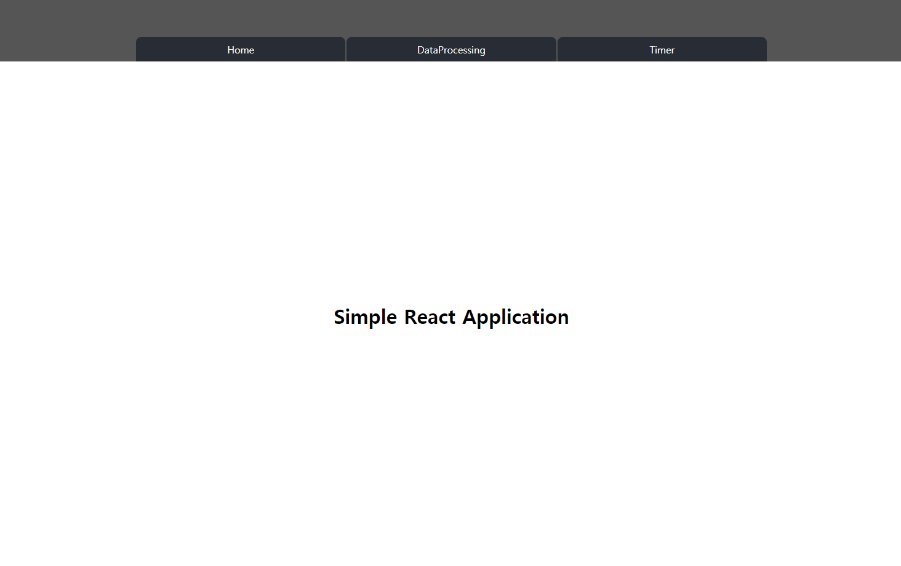
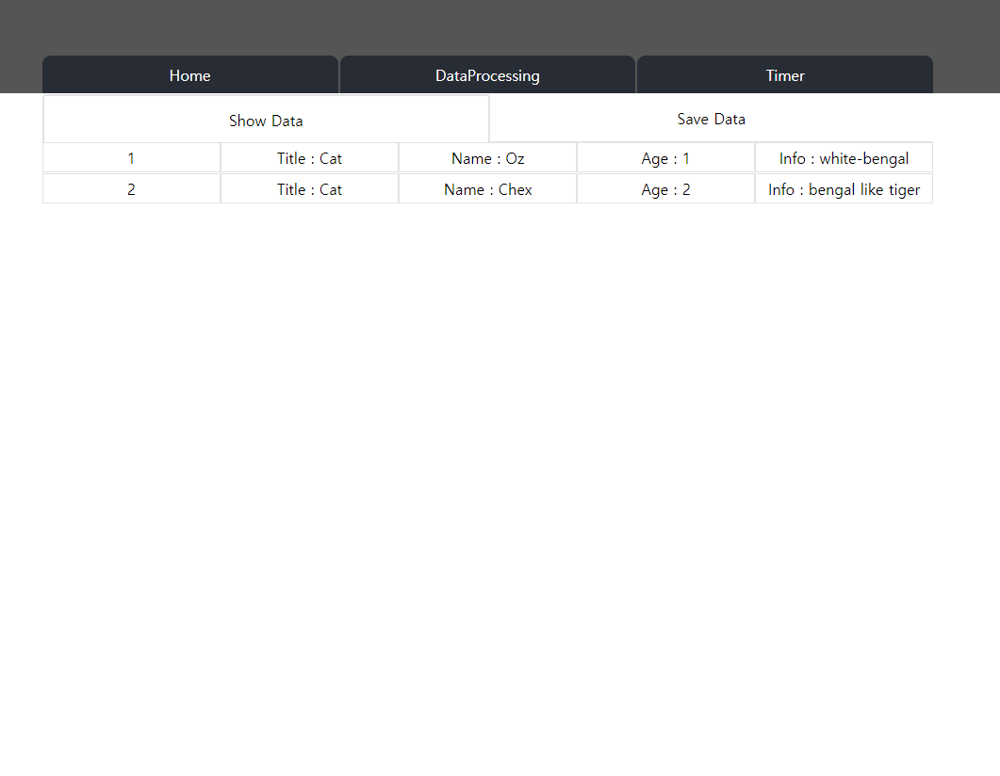
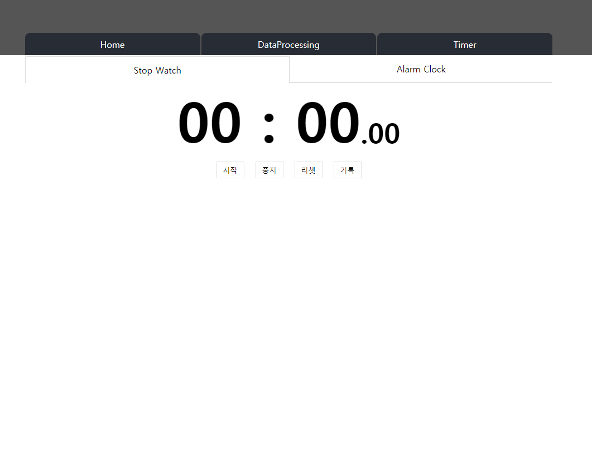
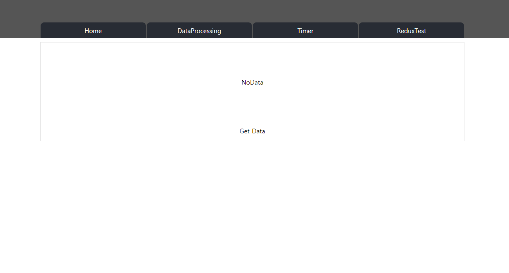

# React Apllication
React, Nodejs, Express 를 사용한 간단한 웹 어플리케이션 입니다.

# 사용 기술
* React 16
* Redux / Redux-thunk
* Nodejs 8
* Express 4
* Axio 
* Webpack 4
* Babel 7

# 실행
1. ` git clone https://github.com/Dokbawi/prof2.git `
2.  `cd prof2`
3. ` npm install `
4. ` npm run dev `
5. http://localhost:3001 로 접속하시면 됩니다.
